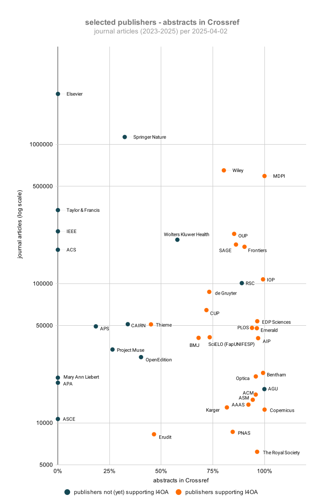

# I4OA - monthly statistics
Monthly statistics Initiative for Open Abstracts (I4OA)

Querying Crossref API for proportion of current* journal articles with abstract, per Crossref member ID.
Data are used in Google Sheets to create a chart of the proportion of open abstracts for 50 selected publishers, as displayed on the [I4OA website](https://i4oa.org/). 

Data are also collected monthly for book chapters and preprints.

* *current = current year and 2 previous years*

